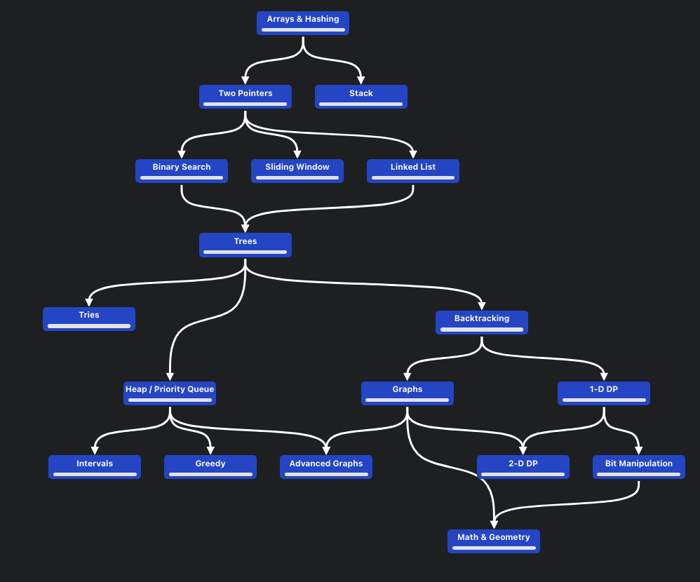

### Problem sets

- Blind75
- [Grind75](https://www.techinterviewhandbook.org/grind75)

### Simple algo patterns

1. 2 pointers
2. Matrix traversal
3. Fast/slow pointers
4. Sliding window
5. Merge intervals
6. Cyclic sort
7. In-place linked list reversal
8. BFS/DFS
9. 2 heaps
10. Subsets
11. Modified binary search
12. Top K elements
13. Bitwise XORs
14. Backtracking
15. Knapsack
16. Topological sort
17. K-way merge
18. Monotonic stack
19. Multi-threaded

### DSA concepts

- <https://neetcode.io/roadmap>

