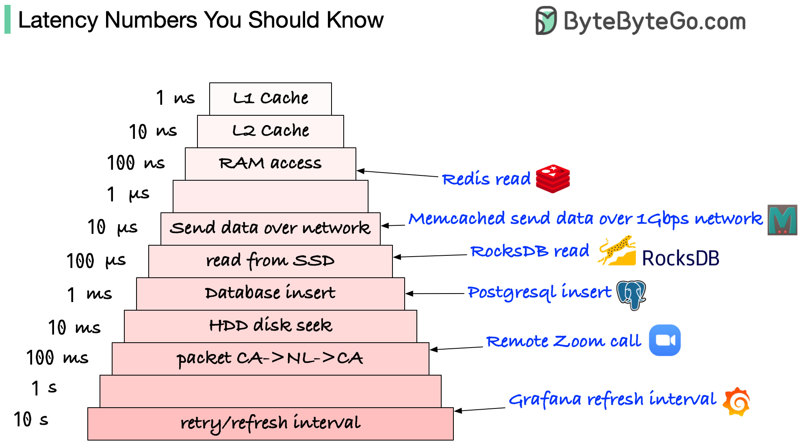
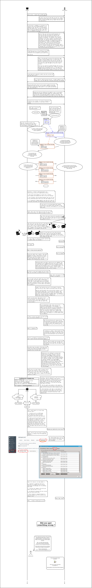

### Latency

(Accurate as of 2023)

| Event                          | Latency   | Human       |
| ------------------------------ | --------- | ----------- |
| 1 CPU cycle                 | 0.3ns     | 1s          |
| Level 1 cache access           | 0.9ns     | 3s          |
| Level 2 cache access           | 2.8ns     | 9s          |
| Level 3 cache access           | 12.9ns    | 43s         |
| Main memory access             | 120ns     | 6 min       |
| Solid-state disk IO            | 50-150mis | 2-6 days    |
| Rotational disk IO             | 1-10ms    | 1-12 mths   |
| Internet: SF to NYC            | 40ms      | 4 yrs       |
| Internet: SF to UK             | 81ms      | 8 yrs       |
| Internet: SF to Australia      | 183ms     | 19 yrs      |
| OS virtualization reboot       | 4s        | 423 yrs     |
| SCSI command time-out          | 30s       | 3000 yrs    |
| Hardware virtualization reboot | 40s       | 4000 yrs    |
| Physical system reboot         | 5m        | 32 millenia |
### SSL

